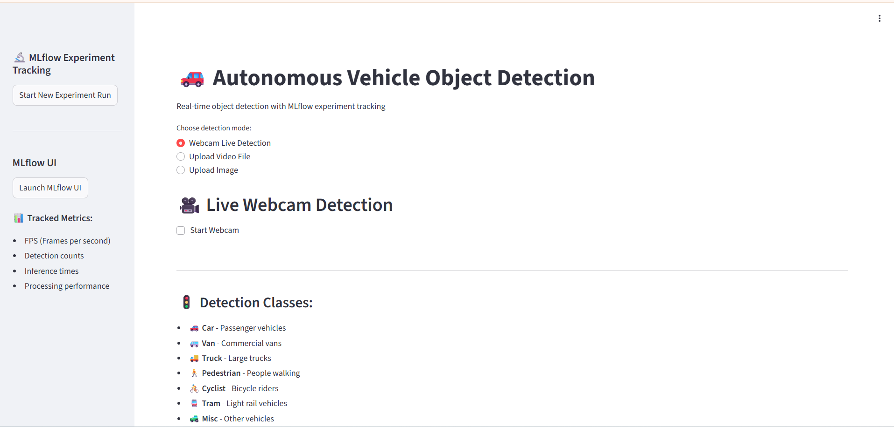
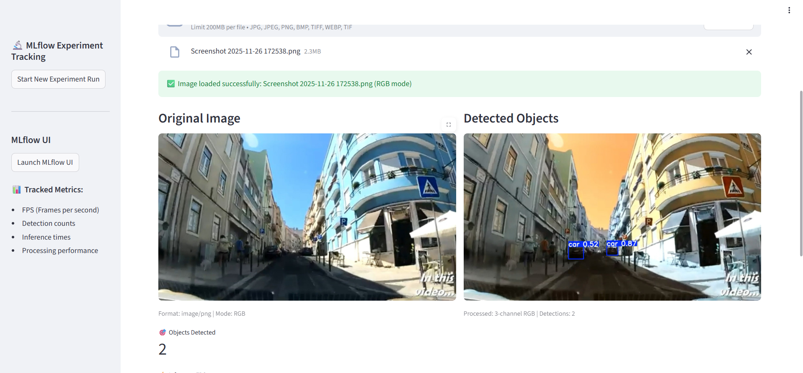
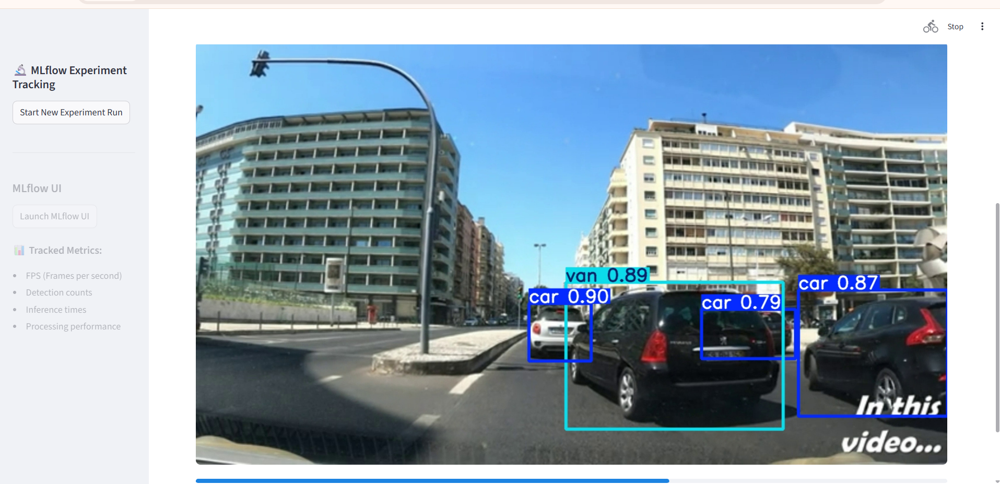

Perfect 👍
Below is the **final complete `README.md` file**, ready to **copy–paste directly into GitHub**.
It includes **everything**: overview, tech stack, methodology, results, deployment, UI images, structure, and author.

---

# 🚗 Real-Time Object Detection for Autonomous Vehicles

An end-to-end **real-time object detection system** for autonomous driving applications using **YOLO11**, featuring **model screening, fine-tuning, MLOps tracking with MLflow**, and **real-time deployment via Streamlit**.

---

## 📌 Project Overview

This project implements a complete **computer vision + MLOps pipeline** to detect critical road objects such as cars, pedestrians, cyclists, and trucks in real-time.  
The system is trained and evaluated on the **KITTI Vision Benchmark dataset** and deployed as an interactive **Streamlit application** supporting webcam, image, and video inference.

---

## 🧠 Key Features

- YOLO11-based object detection (n / s / m variants)
- Automated model screening with accuracy–speed tradeoff
- Transfer learning & fine-tuning
- MLflow experiment tracking & model registry
- Real-time inference deployment using Streamlit
- Supports webcam, image, and video input

---

## 🛠️ Tech Stack

| Category | Tools |
|--------|------|
| Language | Python |
| Framework | Ultralytics YOLO |
| Dataset | KITTI Object Detection |
| Metrics | mAP50, mAP50–95, Precision, Recall, FPS |
| MLOps | MLflow |
| Deployment | Streamlit |
| Visualization | OpenCV, Matplotlib |
| Platform | Kaggle GPU Notebook |

---

## 📂 Dataset

- **Dataset:** KITTI Vision Benchmark Suite (Object Detection)
- **Classes:**  
  `car, van, truck, pedestrian, cyclist, Person_sitting, tram, misc`
- **Format:** YOLO annotation format
- **Challenges:** occlusion, lighting variation, small objects, real-world traffic scenes

YOLO11 automatically handles:
- Image resizing
- Normalization
- Data augmentation
- Tensor conversion during training

---

## ⚙️ Methodology

### 🔹 Model Screening
Three YOLO variants were evaluated:
- **YOLO11n** (2.5M parameters)
- **YOLO11s** (6.0M parameters)
- **YOLO11m** (18.0M parameters)

Each model was:
- Trained for **3 epochs**
- Evaluated using **mAP50, mAP50–95**
- Benchmarked for **FPS**

**Performance Score Formula:**
```

performance_score = mAP50 × 0.7 + (FPS / 100) × 0.3

```

➡️ **YOLO11s** achieved the best accuracy–speed balance and was selected.

---

### 🔹 Full Training & Fine-Tuning
- Epochs: **50**
- Image size: **640×640**
- Batch size: **16**
- Transfer learning from pretrained weights
- Augmentations: **MixUp, Copy-Paste**
- Early stopping (patience = 10)

---

## 📊 Results

| Metric | Value | 
|------|------|  
| mAP50 | **0.88** |  
| mAP50–95 | **0.73** |  
| FPS | **Real-time capable (≥30 FPS)** |  
| Best Classes | Cars, Cyclists |  

The final model satisfies **real-time autonomous driving requirements**.

---

## 🚀 Deployment (Streamlit + MLflow)

The project includes a **fully interactive Streamlit application** with integrated **MLflow tracking**.

### Supported Modes
- 🎥 Live Webcam Detection  
- 🎬 Video File Upload  
- 🖼️ Image Upload (universal format support)

### Tracked Metrics (MLflow)
- FPS
- Inference time
- Detection count
- Per-mode performance (image / video / webcam)

---

## 🖥️ Streamlit UI Preview


### 🔹 Main Dashboard


### 🔹 Image Detection


### 🔹 Video Detection


---

## 🏃 How to Run Locally

### 1️⃣ Install dependencies
```bash
pip install ultralytics streamlit mlflow opencv-python pillow
````

### 2️⃣ Run Streamlit app

```bash
streamlit run streamlit.py
```

### 3️⃣ (Optional) Launch MLflow UI

```bash
mlflow ui --port 5000 --host 127.0.0.1
```

Then open:
👉 [http://localhost:5000](http://localhost:5000)

---

## 📁 Repository Structure

```
├── streamlit.py        # Real-time inference app
├── main.py             # Training, screening, evaluation pipeline
├── YOLO11/kitti.yaml          # Dataset configuration
├── best.pt             # Trained YOLO11s weights
├── assets/             # Streamlit UI screenshots
└── README.md
```

---

## 🎯 Detection Classes

* 🚗 Car
* 🚐 Van
* 🚚 Truck
* 🚶 Pedestrian
* 🚴 Cyclist
* 🚊 Tram
* 🚜 Misc

---

## 📌 Conclusion

This project demonstrates a **complete real-world autonomous driving perception pipeline**, covering:

* Dataset analysis
* Model selection
* Training & evaluation
* MLOps integration
* Real-time deployment

The YOLO11-based system achieved **high accuracy with real-time performance**, making it suitable for autonomous vehicle applications.

---

## 👤 Author

**Mostafa Abdelrashid**
📧 [mostafa.abdelrashid4@gmail.com](mailto:mostafa.abdelrashid4@gmail.com)
🔗 [LinkedIn](https://www.linkedin.com/in/mostafa-abdelrashid-3b6331315/)
💻 [GitHub](https://github.com/mostafa-abdelrashid)


